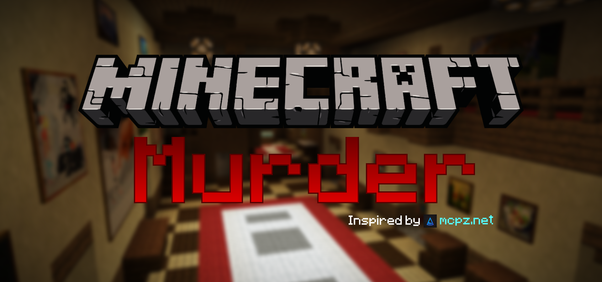

# MurderPlugin

Minecraft minigame plugin inspired by Murder/MCPZ. Minimal setup, arena management, and lobby flow.

## Quick Notes
- Target: Paper 1.21.x
- Commands: `/murder` (subcommands: arena, join, leave, debug, lobby)
- Uses dynamic command registration (no plugin.yml command entries)
